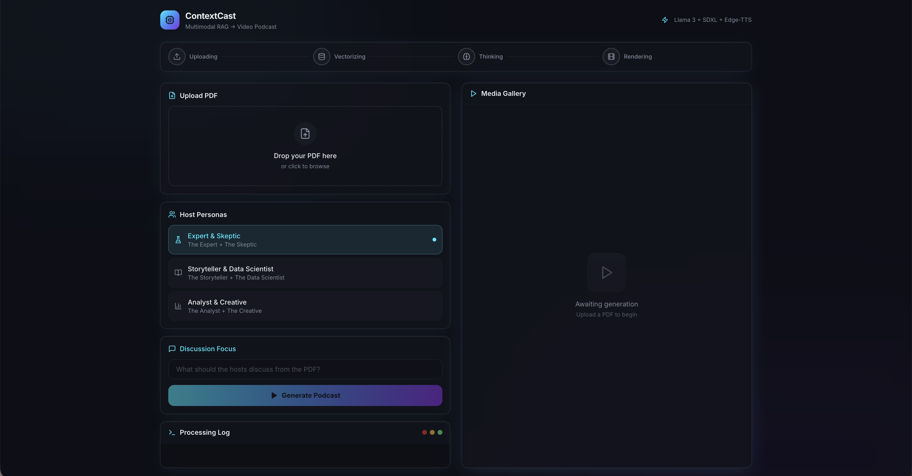

This updated README is designed to look elite on your GitHub profile. I've added a **Architecture Diagram** section and polished the formatting to highlight the "Full-Stack" nature of the project.

---

# 🎙️ ContextCast AI: Multimodal RAG-to-Video Pipeline

**ContextCast** is an end-to-end AI platform that transforms complex PDF documents into high-fidelity, 2-minute video podcasts. By orchestrating a sophisticated **RAG (Retrieval-Augmented Generation)** pipeline, the system generates technical debates between AI host personas, synthesized with neural voices and dynamic generative visuals.



---

## 🚀 Core Features

* **Deep-Dive RAG Engine:** Leverages **ChromaDB** and **Sentence-Transformers** for semantic retrieval, ensuring all dialogue is grounded in the source document's facts.
* **Dynamic Host Personas:** Seamlessly switch between host pairs (e.g., *Expert & Skeptic* or *Analyst & Creative*) with unique vocal characteristics and debate styles.
* **Multimodal Synthesis Pipeline:**
    * **LLM:** Llama 3 (via Ollama) for high-reasoning technical scriptwriting.
    * **TTS:** Edge-TTS Neural voices for realistic, multi-accent dialogue synthesis.
    * **CV:** Stable Diffusion XL (SDXL) for generating contextually relevant cinematic backgrounds.
* **Real-Time Orchestration:** Built with a **FastAPI** backend using Server-Sent Events (SSE) to provide live status updates to a modern **React** dashboard.

---

## ⚙️ Architecture & Data Flow

1.  **Ingestion & Vectorization:** PDFs are parsed, chunked, and embedded into a local ChromaDB vector store.
2.  **Contextual Retrieval:** The system performs a similarity search based on the user's "Discussion Focus" to extract relevant technical data.
3.  **Script Generation:** Llama 3 processes the context to write a structured 10-line debate script.
4.  **Neural Audio Synthesis:** Parallel processing converts script lines into high-quality speech using specific Neural Voice IDs.
5.  **Visual Composition:** A cinematic background is generated via SDXL, and **FFmpeg** performs the final render, muxing the background and audio into an `.mp4` file.


---

## 🛠️ Tech Stack

| Layer | Technology |
| :--- | :--- |
| **Frontend** | React, Vite, Tailwind CSS, Framer Motion |
| **Backend** | FastAPI, Uvicorn, Python 3.10+ |
| **Database** | ChromaDB (Vector Store) |
| **AI Models** | Llama 3 (Ollama), Stable Diffusion XL |
| **Media** | FFmpeg, Pydub, Edge-TTS |

---

## 📂 Project Structure

```text
podcastgenerator/
├── README.md           # Project Documentation
├── .gitignore          # Root-level ignore (Node & Python)
├── ai_studio/          # Backend Server & AI Logic
│   ├── server.py       # FastAPI Entry Point
│   ├── rag_engine.py   # PDF Processing & Vector Search
│   └── requirements.txt
└── frontend/           # React Application
    ├── src/            # UI Components & Hooks
    └── package.json
```

---

## 🛠️ Installation & Setup

### Prerequisites
* Python 3.10+
* Node.js & NPM
* [Ollama](https://ollama.com/) (Ensure `llama3` is pulled)
* FFmpeg installed on your system (`brew install ffmpeg` on Mac)

### 1. Backend Setup
```bash
cd ai_studio
python -m venv venv_stable
source venv_stable/bin/activate
pip install -r requirements.txt
python server.py
```

### 2. Frontend Setup
```bash
cd frontend
npm install
npm run dev
```

---

## 👨‍💻 Author

**Rijul Sitpure**
* **Degree:** B.Tech in Data Science
* **University:** Manipal University

---

### 💡 Final Tip for your GitHub:
Once you upload the screenshot to your repo, make sure the filename in the README matches (e.g., `dashboard.png`). This README now positions you as a serious developer who understands both **AI Orchestration** and **Full-Stack Engineering**.

**Ready to update your `README.md` and finish the night on a high note?**